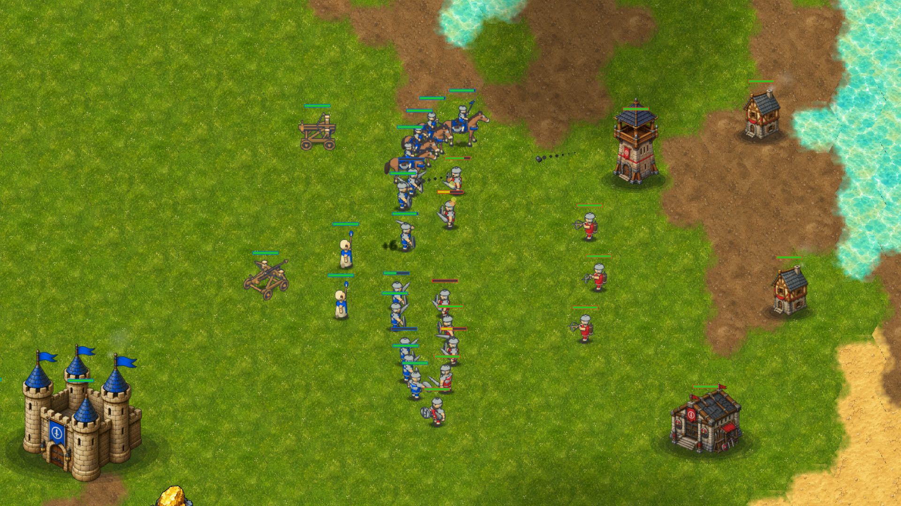
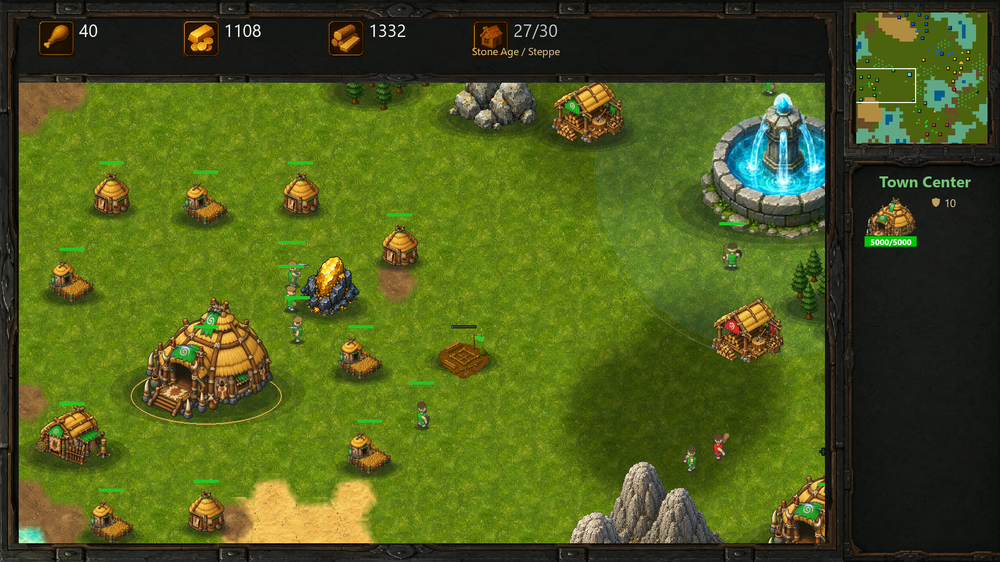
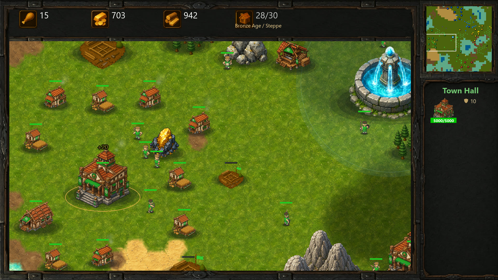
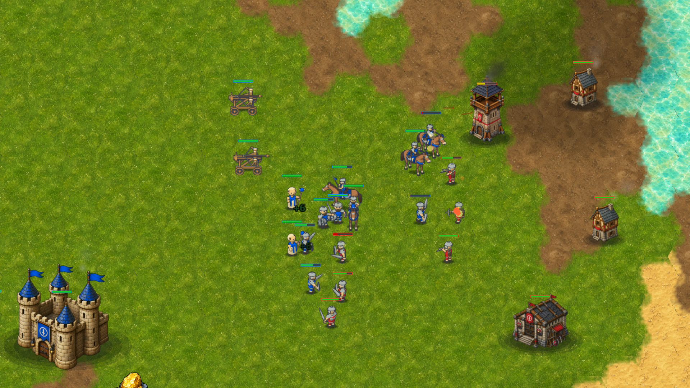
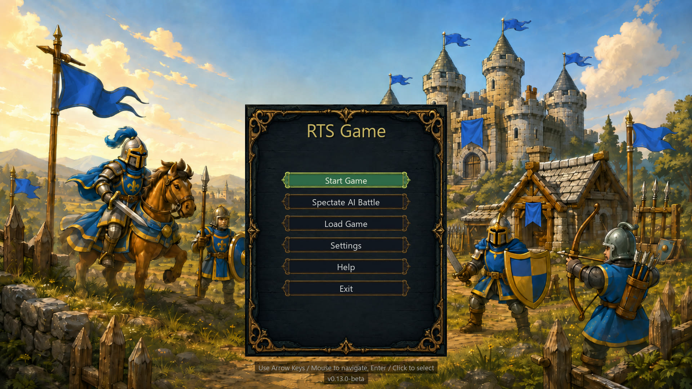

# RTS

Build a settlement. Advance through three ages. Lead cavalry, infantry, healers
and siege into battle.

A classic single-player real-time strategy game inspired by Age of Empires and
Warcraft, built in Python and Pygame. Play against the AI on procedural island
maps, or watch rival AI armies fight in spectator mode.

**[Download for Windows](DOWNLOAD.md)** · **[Player wiki](https://github.com/ilankt/RTS/wiki)** · **[Watch the trailer](https://www.youtube.com/watch?v=9bWxDqkOkM8)** · **[Report a bug](https://github.com/ilankt/RTS/issues)**

[](https://www.youtube.com/watch?v=9bWxDqkOkM8)

*Watch 42 seconds of settlement building, exploration, age advancement and combined-arms combat—with the game's music and sound effects.*

## Build, explore, conquer

- **Three ages:** grow from a Stone Age Town Center to an Iron Age Castle.
  Buildings and Workers change appearance as you advance; research military
  upgrades to equip the rest of your army.
- **Two factions:** Steppe Clans add fast Horse Archers; Highland Clans add
  Axemen that break through sword infantry. Both share seven core unit lines.
- **An economy to protect:** harvest wood and gold, build Farms for automatic
  food income, expand with 12 building types, and invest in six research families.
- **Armies with different jobs:** hold the line with infantry, raid with cavalry,
  keep healers close, and protect fragile, high-damage Ballistas.
- **Battlefield control:** fog of war, formations, stances, attack-move, queued
  orders, control groups, rally points and save/load.
- **Protect your settlement:** attack alarms and minimap pings help you respond,
  while threatened Workers take shelter and return to work after danger passes.
- **AI opponents:** Easy, Normal and Hard difficulty; Rusher, Boomer, Turtle and
  Balanced personalities; spectator battles with up to eight AI players.

## Screenshots

| Start a settlement | Advance to Bronze Age |
|---|---|
| [](docs/media/stone-age.jpg) | [](docs/media/bronze-age.jpg) |

| Lead a mixed army | Enter the game |
|---|---|
| [](docs/media/combined-arms.jpg) | [](docs/media/main-menu.jpg) |

*Captured from the game for the trailer. The combat showcase uses an arranged
skirmish running the real combat systems. [See the age and faction artwork](docs/media/ages-and-factions.png).*

## Your first match

Download the **[Windows installer or portable ZIP](DOWNLOAD.md)**—no Python required.
Choose **Start Game**, a small map and one Easy opponent while learning.

1. Select Workers and right-click trees or gold deposits.
2. Build Farms early. They produce food automatically; Workers do not gather food.
3. Add Houses and a Barracks, recruit a mixed army, and scout before expanding.
4. Open your Town Center's **Upgrades** tab when you are ready for Bronze Age.

The **Help** button in the main menu or pause menu opens the illustrated offline
field manual. The same guide is available in the **[player wiki](https://github.com/ilankt/RTS/wiki)**,
including [ages and upgrades](https://github.com/ilankt/RTS/wiki/Ages-and-Upgrades),
[unit costs and roles](https://github.com/ilankt/RTS/wiki/Units), [economy advice](https://github.com/ilankt/RTS/wiki/Economy)
and [controls](https://github.com/ilankt/RTS/wiki/Controls-and-Saving).

## Status and feedback

Currently **0.13.1-beta**. This is an actively developed hobby game with
AI-assisted development and artwork. The Windows downloads include the current
unit animations, faction portraits and all 30 age-specific building graphics.

The core game is playable end to end. Large battles, crowded navigation, AI
completion and faction balance remain areas of active work. If something goes
wrong, [open an issue](https://github.com/ilankt/RTS/issues) with the version,
match settings and steps to reproduce it. Screenshots and saves help.

**[Latest release](https://github.com/ilankt/RTS/releases/latest)** · **[Version history](CHANGELOG.md)**

## Run from source

Python 3.10+ is required; development uses Python 3.12.

```bash
git clone https://github.com/ilankt/RTS.git
cd RTS
pip install -r requirements.txt
python main.py
```

Run `python main.py --spectate` to start an AI spectator match directly.
See [BUILD.md](BUILD.md) for Windows packaging and regenerating the manual/wiki.

The engine uses hex-tile terrain, a square navigation grid with Jump Point
Search, shared flow fields for group movement, and a utility-goal AI. Game
content lives in `data/`; the main code is organized under `core/`, `entities/`,
`systems/`, `managers/`, `ui/` and `world/`.

## Credits

Created by Ilan Kachler, with sound effects from
[Pixabay](https://pixabay.com/sound-effects/) and [Kenney](https://kenney.nl).
See [CREDITS.md](CREDITS.md) for attribution.

Provided as is; see the [download disclaimer](DOWNLOAD.md#disclaimer).
