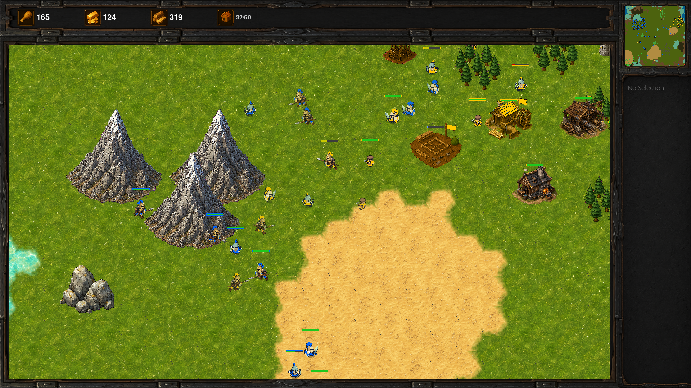
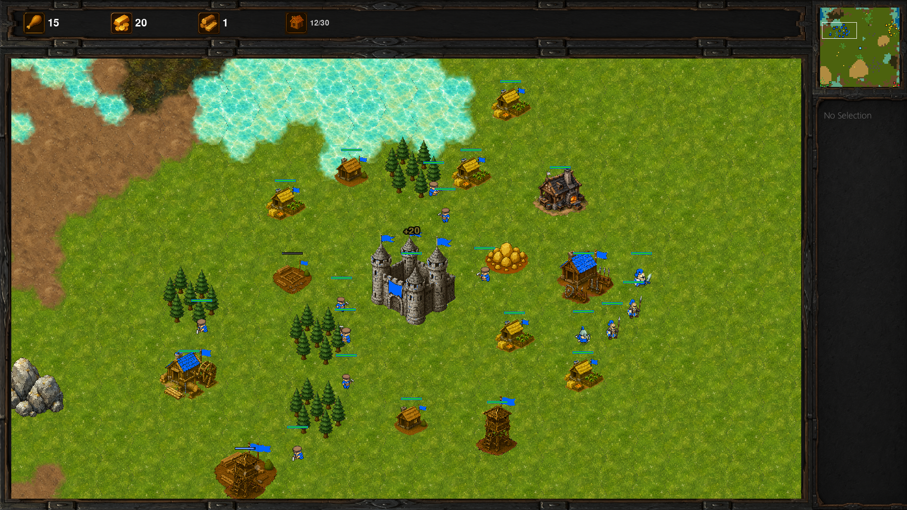
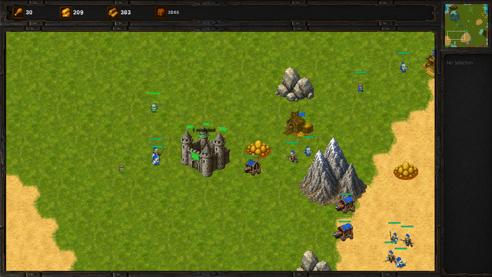
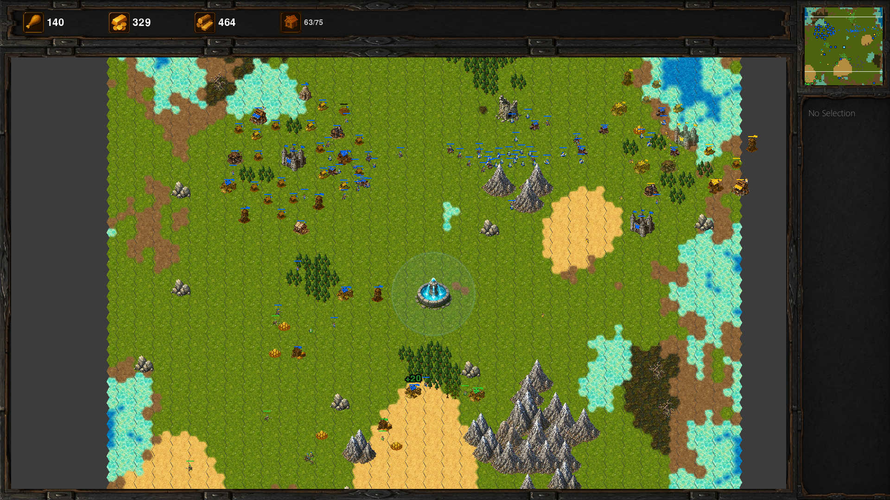

# RTS

A classic real-time strategy game — in the spirit of Age of Empires and Warcraft —
built from scratch in **Python + Pygame**. Hex-tile procedural maps, a full
economy/production/tech loop, and four AI personalities that you can fight or
just sit back and spectate.



## Features

**Gameplay**
- Full RTS loop: gather **gold / wood / food**, expand, tech up, and raze the enemy castle
- **7 units** (worker, warrior, archer, spearman, cavalry, ram, healer) with
  slash/pierce/siege damage types vs light/heavy/fortified armor and
  counter-unit bonuses
- **12 buildings** including production, defense towers, and the temple's
  auto-healing support unit; walls & gates are implemented behind a flag
- **6 blacksmith technologies** (gathering, armor, melee/ranged/siege damage)
- Fog of war with explored-terrain memory and last-seen resource ghosts
- Formations, unit stances, attack-move, shift-queued orders, control groups,
  rally points, camera bookmarks, save/load
- Adjustable game speed (1–5×), match setup with map-size choice

**AI**
- Utility-goal AI: every 0.5 s each AI scores 30+ goals (economy, military,
  tactical) against a snapshot of its situation and executes the best ones
- Four personalities — **rusher, boomer, turtle, balanced** — weight those
  goals differently; armies muster at forward rally points and attack in waves
- **Spectate AI Battle** mode: watch 2–4 AIs fight it out with the whole map revealed

**Engine**
- Hex-tile terrain rendering with biome sprite variants over a square
  navigation grid for movement
- Jump Point Search pathfinding with incremental obstacle updates, per-frame
  time budgets, and cross-frame resumable searches — no frame ever stalls on a
  cross-map path
- Shared flow fields for large group moves; context-steering collision
  avoidance with right-of-way rules
- Procedural island maps (Perlin noise): biomes, mountain ridges, forests as
  choppable props, with a guaranteed-reachable spawn layout

## Screenshots

| | |
|---|---|
|  |  |
|  |  |

## Getting Started

**Just want to play?** Download the Windows installer (or portable zip) from the
[Releases page](https://github.com/ilankt/RTS/releases) — no Python required.

To run from source, you need **Python 3.10+** (developed on 3.12).

```bash
git clone https://github.com/ilankt/RTS.git
cd RTS
pip install -r requirements.txt   # pygame, perlin-noise
python main.py
```

From the menu: **Start Game** for a match against the AI, or
**Spectate AI Battle** to watch four AIs play each other.

A prebuilt Windows package can be produced with [BUILD.md](BUILD.md).

## Controls

| Input | Action |
|---|---|
| Left click / drag | Select units (Shift = add to selection) |
| Right click | Move / gather / attack / repair (Shift = queue orders) |
| WASD / arrows / edge scroll | Pan camera; mouse wheel zooms |
| Ctrl+1–9 → 1–9 | Assign / recall control groups |
| Q E R T / Z X C V | Command-card hotkeys (build, train, research) |
| S / F / G | Cycle stance / formation / toggle gates |
| Tab | Cycle army units (or swap build tabs while building) |
| Home | Jump to your castle |
| B / N | Set / cycle camera bookmarks |
| F1 / F2 | Select idle worker / all production buildings |
| F5 / F9 | Quick save / load |
| [ / ] | Game speed down / up |

All hotkeys are rebindable (`keybindings.json`, editable in-game via Settings).

**Debug:** F3 pathfinding overlay · F4 AI goal-score panel · F6 toggle fog.

## Project Layout

```
core/       main loop, config, game state
entities/   units, buildings, resources, players (data-driven from data/*.json)
systems/    pathfinding, movement, collision, combat, fog, rendering, ...
systems/ai/ utility-goal AI: goals, personalities, military/worker/scout brains
managers/   selection, sprites, sound, save/load
ui/         HUD, command card, minimap, menus
world/      hex map generation + camera
data/       units.json, buildings.json, techs.json — all game content
```

## Status

Actively developed hobby project. The core game is fully playable end to end;
current work focuses on performance at 200+ unit battles, wall/gate sprites,
and world/art polish.
